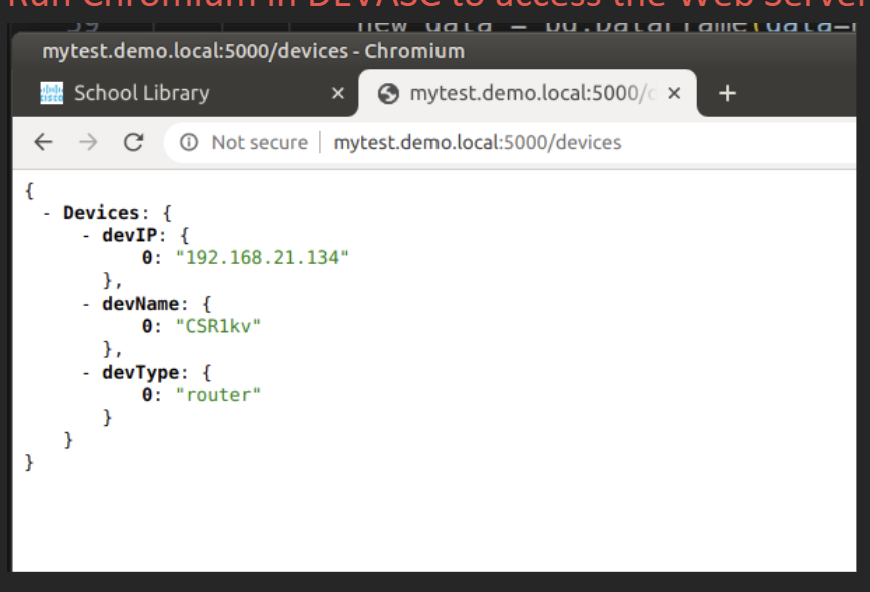
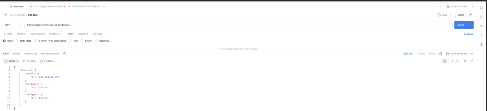
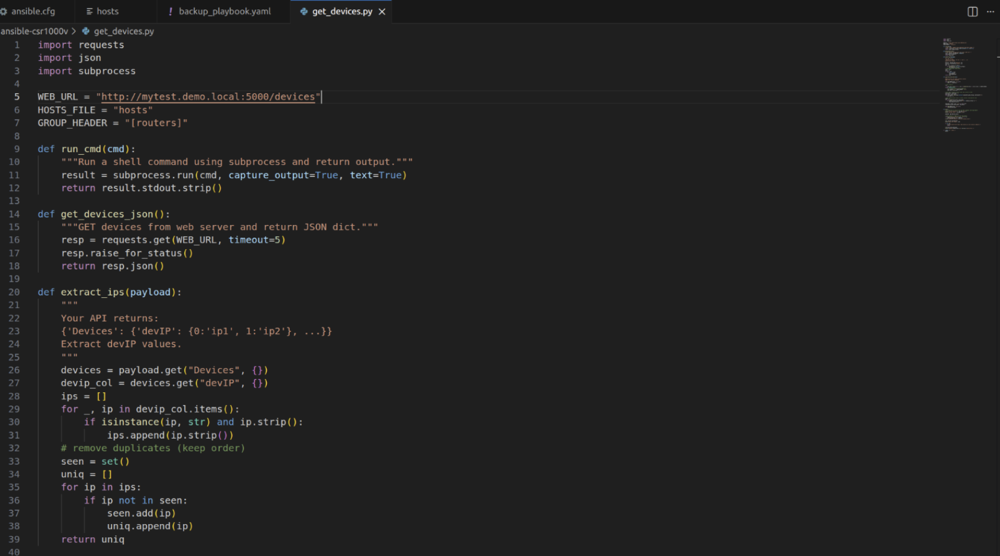
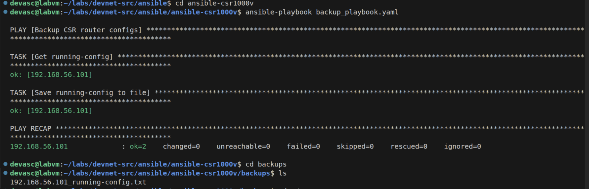
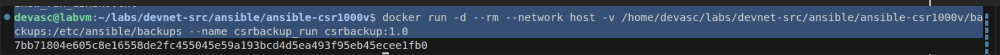

# deveops-network-automation
Developed a DevOps automation workflow for Cisco configuration backup using Python, REST APIs, Ansible and Docker.
# DevOps Network Automation

> Automated Cisco network configuration backup using **Python, REST APIs, Ansible, and Docker**.

## Project Overview

This project demonstrates the development of a DevOps-based network automation solution that automates Cisco router configuration backups using Python, REST APIs, Ansible, and Docker.

The solution dynamically retrieves network device information from a RESTful API, updates the Ansible inventory automatically, and executes configuration backups within a containerized environment. This reduces manual administration while improving scalability, consistency, and reliability.

---

## Project Highlights

* 🔹 Automated Cisco router configuration backups
* 🔹 Dynamic device inventory generation using REST APIs
* 🔹 Python automation for inventory management
* 🔹 Infrastructure as Code with Ansible
* 🔹 Docker containerization for portable deployment

---

## Problem Statement

Managing network device backups manually can be time-consuming and error-prone, especially as the number of devices increases. Static inventories also require frequent manual updates, making automation difficult to maintain.

This project addresses these challenges by automatically retrieving device information from a RESTful API, generating the Ansible inventory, and performing configuration backups through a fully automated workflow.

---

## Solution Architecture

The solution consists of four main components:

1. RESTful API for network device management
2. Python automation for dynamic inventory generation
3. Ansible playbook for configuration backup
4. Docker container for deployment

> **Architecture diagram will be added in a future update.**

---

## Technologies Used

* Python
* Flask REST API
* Docker
* Ansible
* Cisco CSR1000v
* Postman
* Ubuntu Linux

---

## Workflow

1. Device information is stored in a RESTful API.
2. Python retrieves the device list.
3. The Ansible inventory is updated automatically.
4. Ansible connects to each Cisco router.
5. Running configurations are backed up.
6. Docker packages the complete workflow into a portable environment.

---

## Project Demonstration

The following screenshots demonstrate the implementation and successful execution of the DevOps Network Automation solution.

---

### 1. Solution Architecture

The overall architecture of the solution illustrates how the REST API, Python automation, Docker, and Ansible work together to automate Cisco configuration backups.

  

---

### 2. REST API

The Flask REST API successfully exposes network device information in JSON format.

  

---

### 3. API Testing with Postman

The REST API endpoint is validated using Postman before executing the automation workflow.

  

---

### 4. Python Automation

Python retrieves device information from the REST API, extracts device IP addresses, and dynamically updates the Ansible inventory.

  

---

### 5. Ansible Configuration Backup

The Ansible playbook connects to Cisco routers and automatically backs up the running configuration.

  

---

### 6. Docker Deployment

The complete automation workflow is packaged and executed inside a Docker container for consistent deployment.

  

---

## Skills Demonstrated

* Network Automation
* DevOps
* Python Programming
* REST API Development
* Docker Containerization
* Ansible Automation
* Linux Administration
* Infrastructure as Code (IaC)
* Git & GitHub
* Network automation
* CI/CD concepts

---

## Repository Status

This repository documents my diploma project completed at Singapore Polytechnic. It includes project documentation, architecture diagrams, implementation screenshots, and demonstrates the complete DevOps network automation workflow. Additional enhancements and documentation may be added over time.

---

## Disclaimer

This project was developed as part of my Diploma in Computer Engineering at Singapore Polytechnic. Any configuration files, IP addresses, or sample data included in this repository are intended for educational and demonstration purposes only.
